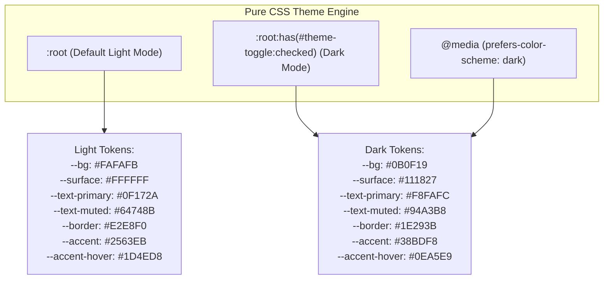
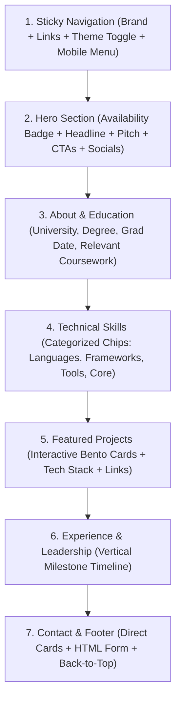
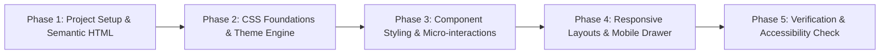

# Product Requirement Document (PRD)
# Project: Modern Minimalist Student Portfolio Website

**Document Status:** Approved & Finalized  
**Owner:** Girish Bajaj (BITS Pilani, Batch of 2030)  
**Tech Stack:** 100% Pure HTML5 & CSS3 (Strictly Zero JavaScript)  
**Target Profile:** BITS Pilani Engineering Student, Developer & State-Level Athlete  
**Design Aesthetic:** Modern Minimalist (High contrast, crisp typography, generous whitespace, subtle borders)  
**Target Deployment:** GitHub Pages, Vercel, or Netlify  

---

## 1. Executive Summary & Vision

### 1.1 Purpose
The goal is to engineer a portfolio website designed specifically to appeal to recruiters, engineering managers, and technical interviewers. For students and recent graduates, recruiters typically spend less than 45 seconds reviewing a portfolio. This site is optimized for immediate technical credibility, effortless navigation, and instant access to code repositories and resumes.

### 1.2 Guiding Principles
1. **Zero JavaScript Dependency:** 100% of the site's layout, animations, responsive drawer navigation, and light/dark theme switching is powered by standards-compliant HTML5 and modern CSS3 (`:has()`, `:checked`, CSS custom properties, CSS Grid, Flexbox).
2. **Speed & Efficiency:** Static delivery with zero runtime overhead, achieving near-perfect 100/100 Lighthouse performance, accessibility, best practices, and SEO scores.
3. **Information Density with Breathing Room:** Clean typography and visual hierarchy that highlights key academic achievements and project work without visual clutter.

---

## 2. Design System & Style Tokens

### 2.1 Color Tokens & Theming



#### Exact Design Tokens Table:
| Token Name | Light Theme Value | Dark Theme Value | Purpose |
| :--- | :--- | :--- | :--- |
| `--bg` | `#FAFAFB` | `#0B0F19` | Global page background |
| `--surface` | `#FFFFFF` | `#111827` | Card and navbar background |
| `--surface-elevated` | `#F1F5F9` | `#1E293B` | Hover states, pill tags, and secondary containers |
| `--text-primary` | `#0F172A` | `#F8FAFC` | Main headings and high-contrast text |
| `--text-muted` | `#64748B` | `#94A3B8` | Body copy, secondary metadata, and dates |
| `--border` | `#E2E8F0` | `#1E293B` | Subtle card borders and horizontal rules |
| `--border-hover` | `#CBD5E1` | `#334155` | Elevated border on card hover |
| `--accent` | `#2563EB` | `#38BDF8` | Primary brand accent, active links, button CTA |
| `--accent-hover` | `#1D4ED8` | `#0EA5E9` | Interactive button hover state |
| `--accent-subtle` | `rgba(37, 99, 235, 0.08)` | `rgba(56, 189, 248, 0.12)` | Badge backgrounds and highlight chips |
| `--status-indicator` | `#10B981` | `#34D399` | Pulsing dot for "Open to opportunities" badge |

### 2.2 Typography Scale
* **Base Font:** `-apple-system, BlinkMacSystemFont, "Segoe UI", Roboto, "Helvetica Neue", Arial, sans-serif`
* **Code / Monospace:** `ui-monospace, SFMono-Regular, "SF Mono", Menlo, Consolas, "Liberation Mono", monospace`
* **Fluid Font Scaling:**
  * Page Title (`h1`): `clamp(2.25rem, 5vw, 3.5rem)` with letter-spacing `-0.03em`
  * Section Title (`h2`): `clamp(1.75rem, 3.5vw, 2.25rem)` with letter-spacing `-0.02em`
  * Subsection Title (`h3`): `1.25rem`
  * Body Text: `1rem` (16px), line-height `1.65`
  * Small / Meta Text: `0.875rem` (14px)

---

## 3. Information Architecture & Section Specifications



### 3.1 Header & Navigation Bar
* **Positioning:** Sticky top (`position: sticky; top: 0; z-index: 100; backdrop-filter: blur(12px)`).
* **Elements:**
  1. **Brand Mark:** Clean text monogram or name (e.g. `alex.dev`).
  2. **Nav Links:** Smooth anchor links to `#about`, `#skills`, `#projects`, `#experience`, `#contact`.
  3. **Theme Switcher:** Pure CSS toggle switch with embedded sun/moon SVG icons.
  4. **Mobile Hamburger Menu:** Pure CSS slide-down drawer triggered via `<label for="menu-toggle">` and hidden `<input type="checkbox" id="menu-toggle">`.

### 3.2 Hero Section
* **Status Badge:** Modern pill badge with a live CSS-pulsing green dot: `"Actively Seeking 2026 Internships / Full-Time Roles"`.
* **Headline:** Punchy introduction introducing name and focus area (e.g., *"Hi, I'm Alex — Computer Science student building scalable web applications."*).
* **Elevator Pitch:** 2–3 sentences highlighting technical passion, key languages, and problem-solving focus.
* **Call to Action (CTA) Group:**
  * Primary Button: `"View Featured Projects"` (smooth scroll to `#projects`).
  * Secondary Button: `"Download Resume"` with download icon and `download` attribute.
  * Direct Icon Links: GitHub, LinkedIn, Email.

### 3.3 About & Education Section
* **Two-Column Responsive Layout:**
  * **Column 1 (Narrative):** Academic background, engineering philosophy, and extracurricular involvement.
  * **Column 2 (Academic Credentials Card):**
    * Institution Name & Location.
    * Degree & Major (e.g., *Bachelor of Science in Computer Science*).
    * Expected Graduation Date (e.g., *May 2026*).
    * Academic Honors / GPA (optional placeholder).
    * **Relevant Coursework:** Pill tags including *Data Structures & Algorithms, Systems Programming, Database Systems, Computer Networks, Software Engineering*.

### 3.4 Technical Skills Section
* **Grid of 4 Categorized Cards:**
  1. **Languages:** Python, C++, Java, JavaScript, TypeScript, SQL, HTML5/CSS3.
  2. **Frameworks & Libraries:** React, Node.js, Express, Next.js, Django, Tailwind CSS.
  3. **Developer Tools & DevOps:** Git, GitHub, Docker, Linux/Bash, VS Code, Postman, CI/CD Actions.
  4. **Core Fundamentals:** Object-Oriented Design, REST APIs, Relational Database Modeling, Algorithm Design.
* **Styling:** Badges with subtle border, soft background tint, and smooth hover micro-transitions.

### 3.5 Featured Projects Section
* **Primary Layout:** 3–4 High-impact project cards in a responsive CSS Grid.
* **Card Anatomy:**
  * Visual banner/preview placeholder with a crisp aspect ratio (`16:9`).
  * Project category badge (e.g., *Full-Stack Web App*, *Systems Software*, *Open Source Tool*).
  * Project title & timeline.
  * Bulleted description:
    * **Problem:** What challenge was addressed?
    * **Solution:** How was it engineered?
    * **Impact:** Measurable result, performance gain, or active users.
  * Tech Stack Chips: Clear tags for technologies used.
  * Action Links:
    * `"Live Demo"` button with external link SVG.
    * `"GitHub Code"` button with repository SVG.
* **Pure CSS Micro-Interactions:**
  * Hover translation: `transform: translateY(-5px);`.
  * Elevating box shadow with subtle accent glow border.

### 3.6 Experience & Leadership Section
* **Layout:** Clean vertical CSS timeline with a continuous vertical guide line and milestone node dots.
* **Entries:**
  * Software Engineering Internships.
  * Teaching Assistant (TA) or Peer Tutoring roles.
  * Hackathon awards & Open Source contributions.
  * Student organization leadership (e.g., ACM Student Chapter, Google Developer Student Club).
* **Card Details:** Role, Organization, Date Range, Location, and 2–3 achievement bullets.

### 3.7 Contact & Footer Section
* **Hybrid Contact Architecture:**
  * **Left Side (Direct Channels):** High-visibility cards with instant access:
    * Direct Email (`mailto:`) with click action.
    * LinkedIn profile link.
    * GitHub profile link.
    * Location / Timezone indicator.
  * **Right Side (Accessible Pure HTML Form):**
    * Fully styled form with fields: Full Name, Email Address, Subject, Message.
    * Submit button with hover transitions.
    * Configurable `action` endpoint ready for [Formspree](https://formspree.io) or [Web3Forms](https://web3forms.com) (free tiers, zero JS required).
* **Footer:**
  * Minimalist copyright notice.
  * "Crafted with 100% Pure HTML5 & CSS3".
  * Smooth "Back to Top" anchor button.

---

## 4. Pure CSS Interactivity Architecture

### 4.1 Pure CSS Dark / Light Mode Switcher
The theme toggle operates without any script tags using modern CSS `:has()` and CSS custom properties:

```html
<!-- Positioned near top of body -->
<input type="checkbox" id="theme-toggle" class="theme-toggle-checkbox" aria-label="Toggle Dark/Light Mode">
<label for="theme-toggle" class="theme-toggle-label" title="Toggle theme">
  <span class="icon-sun">☀️</span>
  <span class="icon-moon">🌙</span>
</label>
```

```css
/* Default: Light Theme */
:root {
  --bg: #FAFAFB;
  --surface: #FFFFFF;
  --text-primary: #0F172A;
  --text-muted: #64748B;
  --border: #E2E8F0;
  --accent: #2563EB;
}

/* User toggled to Dark Theme via checkbox */
:root:has(#theme-toggle:checked) {
  --bg: #0B0F19;
  --surface: #111827;
  --text-primary: #F8FAFC;
  --text-muted: #94A3B8;
  --border: #1E293B;
  --accent: #38BDF8;
}

/* System preference fallback */
@media (prefers-color-scheme: dark) {
  :root:not(:has(#theme-toggle)) {
    --bg: #0B0F19;
    --surface: #111827;
    --text-primary: #F8FAFC;
    --text-muted: #94A3B8;
    --border: #1E293B;
    --accent: #38BDF8;
  }
}
```

### 4.2 Pure CSS Responsive Mobile Drawer
* An off-screen or expanding mobile navigation menu controlled by:
  ```css
  #mobile-menu-toggle:checked ~ .nav-menu {
    display: flex;
    max-height: 400px;
    opacity: 1;
  }
  ```

---

## 5. File & Directory Layout

To maintain maximum portability, zero build tool overhead, and instantaneous deployment:

```text
portfolio/
├── PRD.md                  # This complete requirement specification
├── index.html              # Main semantic HTML5 document
├── css/
│   └── style.css           # Consolidated stylesheet (Variables, Reset, Layout, Components, Animations)
├── assets/
│   ├── icons/              # Embedded or standalone SVG icons (GitHub, LinkedIn, Mail, External Link)
│   ├── images/             # Profile avatar and project screenshot previews
│   └── resume.pdf          # Downloadable resume placeholder
└── README.md               # Quick customization and deployment guide
```

---

## 6. Implementation Roadmap



1. **Phase 1: Semantic HTML Scaffolding**
   * Construct `index.html` with full semantic structure (`<header>`, `<main>`, `<section>`, `<footer>`).
   * Populate accessible content placeholders (Hero, Education, Skills, 3 Projects, Timeline, Form).
2. **Phase 2: CSS Foundations & Theming**
   * Configure CSS variables for Light and Dark modes.
   * Establish typography, fluid spacing, and base reset.
   * Implement pure CSS theme switch.
3. **Phase 3: Component Styling & Micro-Interactions**
   * Style interactive project cards with hover elevations and tag pills.
   * Build the vertical education & experience timeline.
   * Style the contact form and social buttons.
4. **Phase 4: Responsive Refinements**
   * Build pure CSS mobile navigation hamburger toggle.
   * Ensure flawless rendering across mobile (375px), tablet (768px), and desktop (1200px).
5. **Phase 5: Verification & Deployment Readiness**
   * Test keyboard navigation and `:focus-visible` outlines.
   * Verify Lighthouse accessibility and performance benchmarks.
